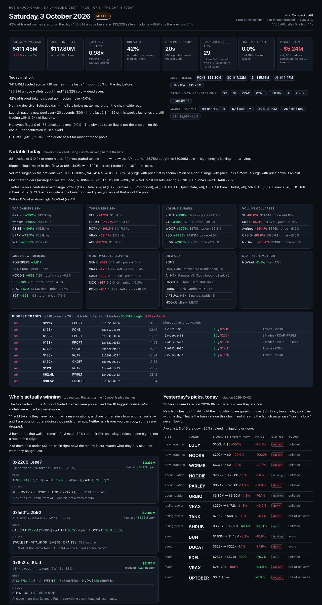

# Robinhood Chain Meme Digest

One command. Three pages. What happened in Robinhood Chain memes in the last 24 hours, which launches deserve a
look, which existing coins are quietly filling up with holders, which are bleeding out, which to leave alone —
and a full workup on every pick: trade flow, holders, top traders, price impact, overhang.

Built on [CoinGecko API](https://www.coingecko.com/en/api?utm_source=x&utm_content=riddlerdefi) data.
Every list, score and flag is computed by this script from that data; none of it is a CoinGecko rating.



## What the report shows

| Section | Question it answers | Raw data it is built from |
|---|---|---|
| **Market overview** | Is the chain hot or cold today? | 24h volume vs the previous 24h, unique buyers vs sellers, % of tokens up, new pools, 7-day survivor rate, honeypot rate, net holders gained |
| **New launches worth a look** | Which of this week's launches are still early *and* clear a safety + traction bar? | Market cap in the $200k–500k window (to $1M on an exceptional score), pool age, liquidity, volume, buyers/sellers, holder growth, top-10 wallet share, distance from launch high, GT Score, socials |
| **Best setups** (per cap band) | Where is demand visible in a token you can still get into — and ideally on a dip? | Holder growth 24h/7d, buyers vs sellers and its 1h trend, volume momentum, dip from 48h high with holders arriving, depth, concentration, share of top-trader supply that came from insiders, listings, GT Score; a +100% day is penalised |
| **Consider rotating out** ($5M–25M) | Which bags are losing power? | Holder history, hourly candles (last 24h vs previous 24h), sellers vs buyers, distance from 48h high |
| **Avoid** | What is being traded today that failed a hard check? | Honeypot flag, mint/freeze authority, zero sells, extreme wallet concentration, thin liquidity vs FDV |
| **Who's winning** | Which wallets realized the most PnL across the most traded memes, and what are they holding now? | Top traders per token, wallet balances and PnL on the chain; bots and insider wallets are tagged and dropped |
| **Yesterday's picks, today** | Did the previous day's picks hold up? | Each day's picks are stored; the next run re-checks liquidity, price and holders |

| **Notable today** | What moved, where big money went, what got listed? | Top gainers/losers, volume surges and collapses, holder gains/losses, CEX listings, near-ATH, and every trade ≥ $10k on the 20 most traded tokens |

**Page 1** is the chain digest: tiles, today in short, notable today, who's winning, yesterday's picks. **Page 2** is new
launches in the early window. **Page 3** is existing coins in two market-cap bands ($300k–5M and $5M–25M), each with a
table of the most traded names and its best setups by score; the $5M–25M band also lists bags losing power. Then the
avoid list. Lists are allowed to be short or empty — a weak pick is worth less than no pick. Every pick gets a deep dive:

- a written read of the token, generated from the numbers (no model, no adjectives the data can't back)
- recent flow: the last ~300 trades — $ bought vs sold, biggest trades, top buyers and sellers by wallet
- top-10 holders with pool / LP / locker contracts labelled
- top traders on the token with realized PnL, average buy → sell price, and a tag when they sold without buying
- price impact estimate for a $1k / $5k / $20k buy (constant-product, from pool reserve)
- overhang: the largest wallet's bag as a share of the pool, and what a full exit would cost
- holder velocity (new wallets per hour, last 6h vs the 6h before) and buyer skew 1h → 24h

Each pick carries the token address (one-click copy), a CoinGecko or GeckoTerminal link and an explorer link,
so you can go from "worth a look" to "looking at it" without retyping anything.

## Run it

Nothing to install beyond Node. No dependencies, no build step, no server. The output is a single HTML file you
open in your browser.

**You need, once:**

1. **Node 22 or newer.** Download it from [nodejs.org](https://nodejs.org) (the LTS build) and run the installer.
   Check with `node -v` in a terminal; it should print `v22` or higher.
2. **Git** — or skip it: on the repo page click **Code → Download ZIP** and unzip the folder.
3. **A CoinGecko API key** on the Analyst plan or above
   ([get one here](https://www.coingecko.com/en/api?utm_source=x&utm_content=riddlerdefi), [pricing](https://www.coingecko.com/en/api/pricing?utm_source=x&utm_content=riddlerdefi)).
   The onchain wallet, holder and megafilter endpoints this report uses are not on the free tier.

**Then, in a terminal** (Terminal on macOS, PowerShell on Windows):

```bash
git clone https://github.com/strvcture/coingecko-rhc
cd coingecko-rhc
cp .env.example .env
```

Open the new `.env` file in any text editor and replace `your-key-here` with your CoinGecko API key. Save it.
(On Windows PowerShell use `copy .env.example .env` instead of `cp`.)

```bash
npm run report
```

It runs for 3–5 minutes and prints progress as it goes. When it finishes, open **`reports/latest.html`** in your
browser — double-click the file, nothing else is needed. A dated copy is kept as `reports/YYYY-MM-DD.html`
so you can look back at earlier days.

**Daily use:** run `npm run report` once a day. Yesterday's picks are re-checked automatically in the
"Yesterday's picks, today" section.

**Cost and cache:**

- A full pull is roughly **1,100–1,300 API credits** and takes 3–5 minutes.
- Market-cap bands, picks per band and the whale-trade threshold are in `src/config.js`.
- Responses are cached per day in `data/cache/`, so re-running the same day costs **zero credits**.
- `npm run report:fresh` ignores the cache and pulls everything again.
- `node src/index.js --no-render` collects and analyzes only (writes `data/YYYY-MM-DD.json`).

**If something goes wrong:**

- `COINGECKO_API_KEY missing` — the `.env` file is missing or the key line still says `your-key-here`.
- Repeated `retry … (HTTP 401)` or `(HTTP 403)` lines — the key is wrong, or the plan does not include the onchain endpoints. Check your plan on the pricing page above.
- `429 rate limited` lines — the script waits and retries on its own. If it keeps happening, set `CG_CONCURRENCY=2` in `.env`.
- Blank or missing sections — the report says so in place. Some chains do not expose holder history or wallet balances.

### Point it at another chain

```bash
CG_NETWORK=base CG_NETWORK_LABEL="Base" CG_EXPLORER=https://basescan.org npm run report
```

Any network id from `/onchain/networks` works. Other chains get their own files (`reports/latest-base.html`,
`data/history/base/`), so two chains never compare against each other's picks. Holder history and wallet
balances vary by chain; where a field is missing the report says so instead of hiding the section.
A Base run from the same day is committed as [`reports/2026-10-02-base.html`](reports/2026-10-02-base.html).

## How the picks are made

All thresholds live in [`src/config.js`](src/config.js) and are printed above each section of the report.
The defaults:

- **New launch**: market cap $200k–$500k (up to $1M only with a score of 80+) · first pool 1h–7d old · liquidity
  ≥ $15k · 24h volume ≥ $10k · ≥ 30 unique buyers · ≥ 100 holders · top-10 wallets (excluding pool/LP contracts)
  ≤ 45% · not more than 60% off its high · not a clone of a bigger token · no red flag · score ≥ 60. Ranked 0–100
  on holder growth, buyer skew, unique buyers, depth, turnover, range, GT Score, socials/listing and clean flags.
  Launches that already ran past the window are listed for reference, not picked.
- **Best setups**: older than 48h · liquidity ≥ $25k · 24h volume ≥ $20k · turnover ≤ 15× · top-10 wallets ≤ 50%
  · holders not shrinking · no red flags, airdrop spikes or ticker clones · insider-sourced supply ≤ 60% of
  top-trader sells · score ≥ 55. Each pick states its thesis and what would break it.
- **Losing power**: two or more of — holders down ≥ 1.5% in 24h · volume down ≥ 50% vs the previous 24h ·
  sellers ≥ 1.4× buyers · price −25% · −40% from the 48h high. Weighted by liquidity so a fade on a $2M
  token outranks one on a $20k token.
- **Avoid**: any red flag on a token with ≥ $3k volume today.
- **Heat** (HOT / MIXED / COLD): breadth, buyer skew and volume momentum, combined into one score.

## What comes from CoinGecko

CoinGecko API supplies the pool prices, liquidity, volume, buy/sell counts, pool age, token info (GT Score,
honeypot flag, mint/freeze authority, developer holding, holder count and distribution, socials), holder
history, OHLCV candles, top holders, top traders with realized PnL, locked liquidity %, wallet balances, and
coin-level tickers / ATH for tokens listed on CoinGecko.

Not financial advice. Memes on a young chain can go to zero in an afternoon. "Avoid" is a floor, not a guarantee.

## Layout

```
src/cg.js        API client: keep-alive, IPv4-first, retries, 429 handling, per-day disk cache
src/collect.js   one sweep of the chain → raw data (nothing scored here)
src/analyze.js   derived fields, flags, scores, the five lists
src/deepen.js    second pass on listed tokens: trade flow, holder/trader tables, yesterday's picks revisited
src/narrate.js   the written parts, templated from the numbers
src/render.js    one self-contained HTML document (three pages), inline SVG sparklines, no external assets
src/config.js    every threshold
src/index.js     CLI
reports/         generated pages (sample committed)
data/            JSON per day, history of picks, cache (cache is git-ignored)
```

## CoinGecko API

- [CoinGecko API](https://www.coingecko.com/en/api?utm_source=x&utm_content=riddlerdefi)
- [Pricing](https://www.coingecko.com/en/api/pricing?utm_source=x&utm_content=riddlerdefi)
- [Documentation](https://docs.coingecko.com/?utm_source=x&utm_content=riddlerdefi)

The onchain wallet, megafilter and holder endpoints used here need the Analyst plan or above.

## License

MIT
